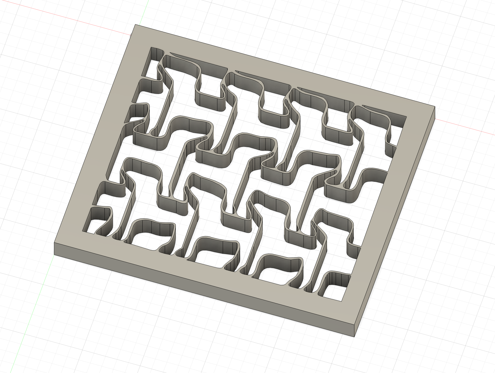
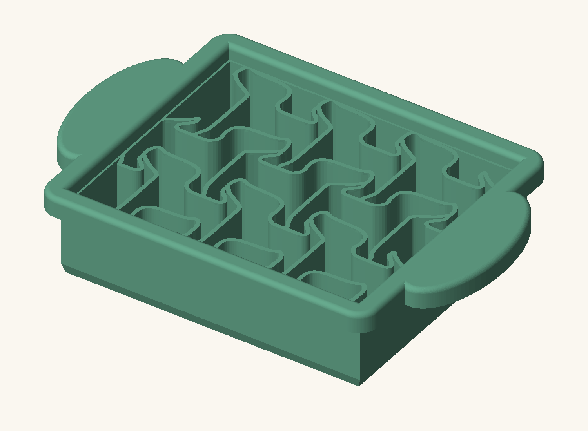
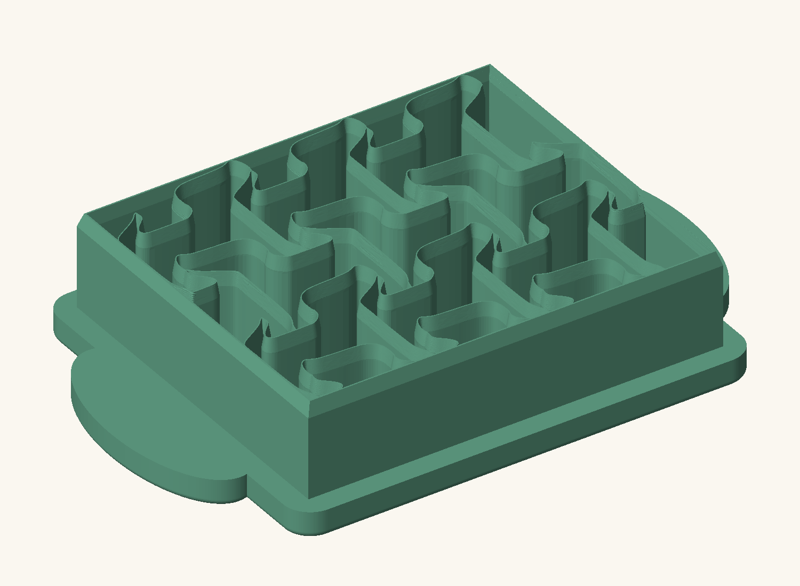
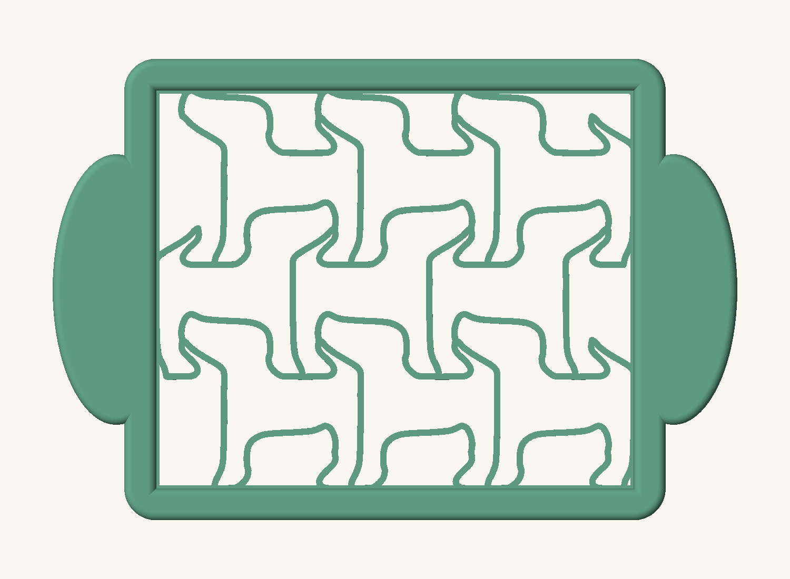
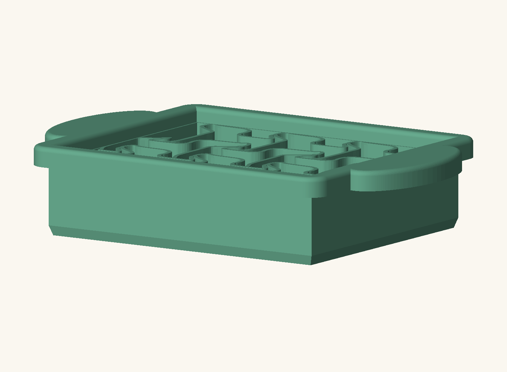

# Tofu dog cutter

A kitchen tool that turns a rectangular sheet of firm tofu into playful dog shapes in one press, helping parents make healthy eating engaging for young children.

## The concept

An integrated grid of dog-shaped cutting blades sits inside a rigid rectangular frame. An adult presses the tool through a sheet of tofu using comfortable outer grips. The design aims to produce larger, recognizable dogs with minimal waste and no need to trim the tofu into a special outline first.

The intended workflow is simple:

1. Slice a roughly 50 mm thick block of firm tofu into two roughly 25 mm thick sheets.
2. Place the cutter over one rectangular sheet.
3. Press down to cut the sheet into playful shapes at once, then release the pieces.

The target internal opening is approximately **120 × 100 mm**. New designs will explore fewer, larger dogs, friendlier silhouettes, tapered knife-like cutting edges, and comfortable surfaces for adult hands to press.

## Current stage

The selected design is **A · nine dogs / 3 × 3**, with no companion shapes. A full CadQuery cutter prototype now combines the repeated nine-dog grid, tapered blades, and rounded palm grips.

- [CAD prototype, dimensions, and build instructions](cad/nine-dogs-3x3/README.md)
- [3D preview](cad/nine-dogs-3x3/index.html)
- [Project preferences](PROJECT_PREFERENCES.md)

### CAD views

| Frame, dog blades, and palm pads | Cutting edge view |
| --- | --- |
|  |  |
| **Original nine-dog layout** | **Tofu clearance beneath the grips** |
|  |  |

The [earlier smoothing and companion review](design/SMOOTHING_REVIEW.md) records exploratory designs that are not the selected CAD baseline. The varied-profile changes are retained as history.

All nine images in [`inspiration/`](inspiration/) were opened and reviewed; see the [inspiration findings](design/INSPIRATION_REVIEW.md). The [earlier profile review](design/PROFILE_REVIEW.md) preserves the A-versus-B comparison.

The [first design review](design/REVIEW.md) preserves the measured STL audit and a separate CadQuery grip study. Its silhouette options were rejected because they did not read sufficiently as dogs and wasted too much space between cutouts.

The audit found a 10 mm tall prototype with an internal opening envelope of approximately 101.4 × 84.1 mm. The redesign retains the owner's stated **120 × 100 mm target**, with clearance for a **25 mm tofu sheet**.

See the review notes for reproduction commands and the local Chrome viewer. The exported `frame-only-study.stl` is an ergonomic geometry study, **not a functional cutter**.

## Prototyping and product direction

Early prototypes will be printed on a Bambu Lab printer to evaluate geometry and handling. These prints are not designated as food-safe finished products. The longer-term goal is to develop a negative mold and cast the tool in a suitable food-safe resin; the resin, mold process, and manufacturing details remain undecided.

The eventual product is a packaged set of four cutters, each with a unique tessellated design and a consistent approach to framing and grips. The dog cutter is the first design under development.

Latest refinement: [varied nine dogs with stable feedback IDs](design/VARIED_REFINEMENT.md).

## Generated files

The STEP, STL, and interactive preview mesh are generated locally and excluded
from Git. The four CAD images above are included and viewable immediately.
See [CAD build instructions](cad/nine-dogs-3x3/README.md#build-and-check) to
regenerate the model and enable the interactive preview after cloning.
