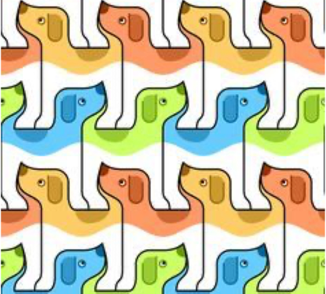
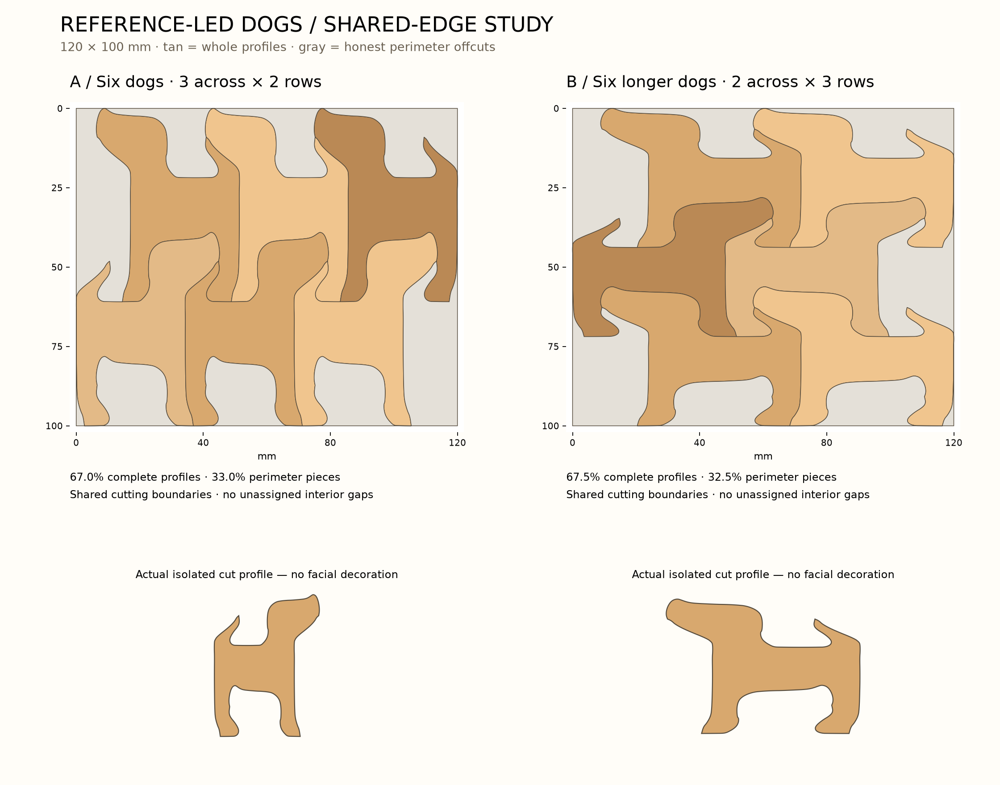

# Side-profile review — corrected direction

The owner rejected the first shapes: they did not look sufficiently like dogs and wasted too much space between independent cutouts. The first round must use **side-profile dogs with shared cutting boundaries**.

The owner supplied the original illustration used to develop the prototype:



This establishes the visual direction: alternating mirrored dogs whose heads fit between the legs of the preceding row. Eyes and floppy-ear markings belong to the illustration; they are not automatically separate cutting features.

## Revised flat studies



Both layouts produce six complete side-profile silhouettes within the 120 × 100 mm rectangle. A keeps taller proportions closer to the reference; B explores a longer body and lower stance. All adjacent dog regions share a single geometric boundary. Gray perimeter regions are retained honestly, and unnecessary cuts between adjacent perimeter scraps are removed.

| Layout | Complete dogs | Area in whole profiles | Perimeter remainder |
| --- | ---: | ---: | ---: |
| A — 3 across × 2 rows | 6 | 67.0% | 33.0% |
| B — 2 across × 3 rows | 6 | 67.5% | 32.5% |

The geometric partition has no unassigned interior gaps and no overlapping regions, within the script's 0.01 mm² check tolerance. This is **not** a zero-waste solution. The ideal geometry has five perimeter regions in A and seven in B. B includes a corner offcut of approximately 18 mm², which conflicts with the preference against very small pieces. Narrow connections between perimeter regions can also separate when finite blade thickness is introduced; region counts are not a prediction of the physical offcuts. Resolving the rectangle's boundaries is the next substantive design problem.

Measurements use ideal zero-width boundaries. Finite blade thickness, draft, release behavior, and tofu deformation are not represented. These drawings are not final cutting geometry or production STL files.

## Geometry method

The script starts with a complete measured prototype profile and recreates its alternating mirrored row arrangement. Boundary-site Voronoi regions close the spaces occupied by the original walls, producing shared boundaries rather than separate spaced outlines. Each shared chain is smoothed once with its junctions held fixed. A small continuous deformation raises the muzzle in the reference's direction; all neighbors receive the same transformation. Selected groups of six whole profiles are scaled to fit the target rectangle, with all remaining perimeter regions explicitly represented.

The two options are proportion studies of the reference motif, not claims of two unrelated new dog designs. Plain isolated profiles are shown in the browser to evaluate recognition without illustrative eyes, ears, or colors.

## Reproduce

Using the pinned environment described in [the original review](REVIEW.md):

```sh
.venv/bin/python scripts/profile_tessellation.py
.venv/bin/python scripts/build_profile_review.py
.venv/bin/python -m http.server 8765 --bind 127.0.0.1
```

Open `http://127.0.0.1:8765/design/profile-review/index.html`. Choose A or B and click a complete dog to inspect its plain silhouette and dimensions.

The original STL and the separate CadQuery frame study remain unchanged by this layout correction. Further 3D cutter work follows an acceptable profile and boundary layout.
