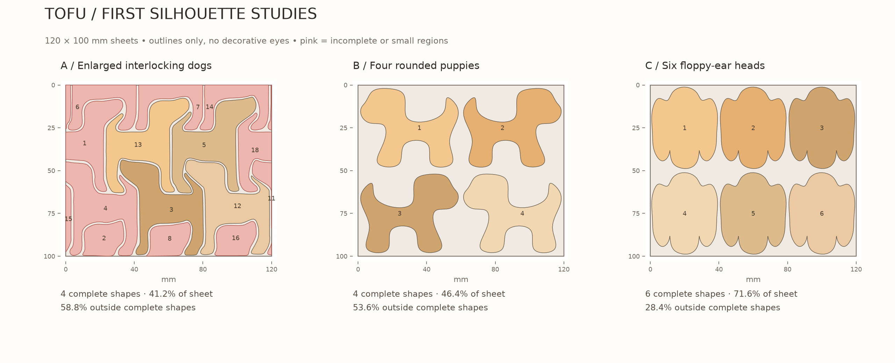
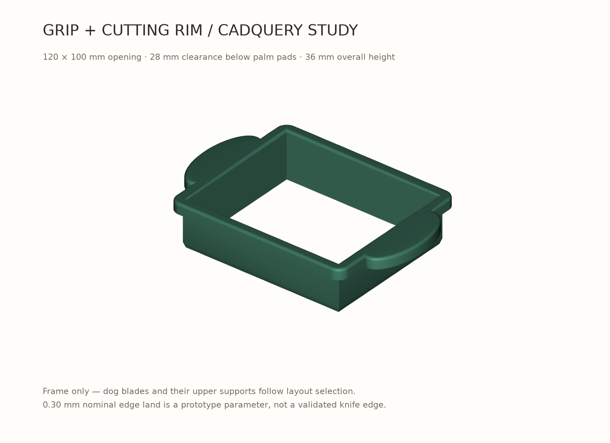

# First design review

**Superseded:** The owner rejected these silhouette studies for weak dog recognition and excessive space between cutouts. Continue with the [side-profile review](PROFILE_REVIEW.md) and the newly supplied original illustration. The geometric audit remains useful.

September 28, 2026. These are exploratory layouts, not an approved cutter design.

## Prototype audit

The STL is a watertight, connected mesh with 20,308 triangles. Assuming millimetres, its outer size is **117.37 × 99.32 × 10.00 mm**. The envelope of its internal openings is approximately **101.39 × 84.08 mm**, rather than the requested 120 × 100 mm. The replacement will use the owner's stated 120 × 100 mm opening; the STL filename is not a dimensional specification.

A horizontal section contains 25 openings. Visual inspection identifies nine complete dogs, one shortened dog against the right boundary, and fifteen other boundary fragments. Complete/fragment classification is a visual judgment, not a shape-recognition measurement. Most large openings have areas near 500–522 mm² and bounding boxes around 31 × 35 mm.

The internal contours and their total open area are unchanged at z = 0.1, 5, and 9.9 mm. This is consistent with straight, untapered internal blade walls. The outer frame changes section with height. The model is only 10 mm tall and cannot pass through a 25 mm tofu sheet in one press.

See [raw measurements](review/prototype-audit.json) and [numbered cross-section](review/prototype-section.png).

## Three silhouette studies



All layouts use a 120 × 100 mm rectangular sheet. Silhouettes are shown without eyes or other decorative features that the cutting outline would not create.

| Study | Complete shapes | Sheet area inside complete shapes | Main limitation |
| --- | ---: | ---: | --- |
| A — Enlarged interlocking dogs | 4 | 41.2% | Enlarging existing contours preserves the boundary-fragment problem. |
| B — Four rounded puppies | 4 | 46.4% | Clear full-body silhouettes, but substantial tofu remains between them. |
| C — Six floppy-ear heads | 6 | 71.6% | Better area use; the silhouette is less distinctly a dog without facial detail. |

A enlarges measured openings by 1.55× and searches a 35 × 35 grid of crop positions for the most complete original dogs, breaking ties by their area. It is a baseline, not a newly solved tessellation. B and C are new smooth silhouette nesting studies, **not zero-scrap tessellations**. B dogs are approximately 57 × 46 mm; C heads are approximately 38.4 × 47.6 mm.

The remaining area includes incomplete shapes, leftover tofu, and, for A, the measured blade footprint. It is **not a measured food-waste rate**: leftover tofu can still be eaten, and finite blade thickness displaces/compresses tofu. B and C currently use ideal outline areas without blade thickness. Their visible gaps and surrounding web will need a deliberate cutting/support strategy. These percentages compare geometry, not manufacturing yield.

None of these studies meets the low-waste goal yet. Simply enlarging the old pattern is not enough. The next layout pass should develop shared boundaries around the preferred silhouette, including deliberate edge pieces that still read as dogs. If full-body dogs are essential, B provides a style direction, not an efficient layout. C is worth pursuing only if dog heads fit the product vision.

## Grip and blade-section study



A separate editable CadQuery model explores the ergonomic envelope without committing to a dog layout:

- 120 × 100 mm constant rectangular opening.
- 28 mm below the pressing surfaces, giving nominal 3 mm clearance over a 25 mm sheet.
- 36 mm overall height.
- Broad opposing oval palm pads with rounded upper edges.
- A 1.6 mm perimeter wall tapering over its lowest 4 mm to a nominal 0.30 mm edge land.

The 0.30 mm edge is an engineering starting point; printability, cutting force, durability, and comfort are untested. The model contains the perimeter rim and grips only. Internal blades and their supports are intentionally pending silhouette selection. **The frame-only STL is not a functional tofu cutter.**

The CadQuery solid and exported mesh are checked for validity, one connected solid, and watertightness. These checks do not establish physical performance, food-contact suitability, or moldability. Mold parting, draft, resin choice, and edge durability remain unresolved.

## Reproduce and review

From the repository root:

```sh
uv venv --python 3.12 .venv
uv pip sync --python .venv/bin/python requirements.lock.txt
.venv/bin/python scripts/explore_designs.py
.venv/bin/python scripts/grip_study.py
.venv/bin/python scripts/build_review.py
.venv/bin/python -m http.server 8765 --bind 127.0.0.1
```

Open `http://127.0.0.1:8765/design/review/index.html` in Chrome. Select an option and click a piece to inspect its area. The layout drawings are geometric study outputs, not simulated tofu or production renders.

CadQuery reference: [official project](https://github.com/cadquery/cadquery). CadQuery source: [grip_study.py](../scripts/grip_study.py). The environment is pinned in [requirements.lock.txt](../requirements.lock.txt).
