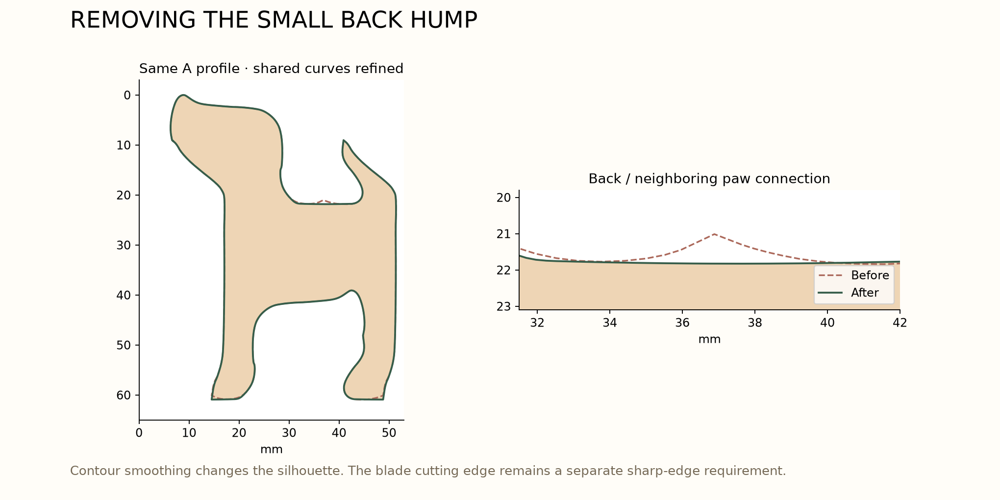

# Smoother profiles and dog-themed companions

The owner requested bones with the original six, smoother dog contours (especially the foot/back hump), and further dog-themed shape research. The live review now opens with **A · original six + Bones** selected.

## Changes

- Bone companions are selectable with all three layouts. The original six admits **five bone candidates** under the current search and size filters.
- The small back rise has been replaced with a nearly flat, gently curved shared segment. The neighboring paw moves with it, preserving the partition rather than creating a gap.
- Broader perimeter profiles also receive a smoothing pass over their shared boundary network, with frame segments retained.
- A common gap-shape selector now offers bones, joined paws, fetch balls, doghouses, hydrants, bowls, and the earlier fish study for every layout. Counts and area metrics update from the selected geometry.



In the illustrated A profile, the measured local crest against its endpoint baseline drops from approximately **0.77 mm to zero** over the specified comparison interval. That is a local hump measurement, not a global curvature certification. Shared junctions and finite blade radii still need their final CAD treatment. The silhouette changes do not blunt the intended knife-like cutting edge in cross-section.

## Fit comparison

Each cell gives **number of companion candidates / percent of sheet remaining**. Dog counts stay six or nine. Companion candidates remain experimental; recognition and physical release need assessment.

| Gap shape | Original six | Repeated nine | Varied nine |
| --- | ---: | ---: | ---: |
| None | 0 / 33.0% | 0 / 27.7% | 0 / 16.9% |
| Bones | 5 / 24.6% | 3 / 23.7% | 2 / 14.5% |
| Joined paws | 7 / 20.8% | 8 / 16.2% | 3 / 12.7% |
| Fetch balls | 5 / 23.0% | 5 / 19.7% | 3 / 12.8% |
| Doghouses | 5 / 25.2% | 5 / 20.5% | 3 / 13.5% |
| Fire hydrants | 5 / 24.8% | 5 / 19.8% | 2 / 14.0% |
| Bowls | 7 / 17.5% | 5 / 18.5% | 3 / 12.4% |
| Fish (earlier study) | 7 / 22.0% | 5 / 20.5% | 2 / 14.0% |

The original six with bones occupies approximately **75.4%** of the sheet in dog and bone outlines, leaving **24.6%** remainder. The search places one companion in each qualifying connected region; it does not optimize multiple small shapes within a region, and these counts are not proven maxima.

## Keyword research and interpretation

Searches included “dog themed cookie cutter shapes bone paw ball dog house collar,” “dog themed cookie cutters bowl collar tag fire hydrant paw,” and dog toy terms including “fetch ball” and “flyer.”

[K9Cakery's dog-themed set](https://www.k9cakery.com/mini-dog-theme-cookie-cutters-5-dog-related-shapes/) lists bones, paws, hydrants, and doghouses. [KONG's dog-toy collection](https://www.kongcompany.com/dog-toys/) supplied the ball and bone toy associations. [A dog-icon cutter listing](https://www.etsy.com/listing/1391479934/dog-icons-cookie-cutter-set-of-5-with) also includes a food bowl. These sources informed the vocabulary; the geometric sketches here were constructed for this project.

- **Bones:** strongest thematic match and the owner's preference; their long aspect ratio suits narrow pockets.
- **Joined paws:** four rounded toe bumps joined to a pad as one piece. A conventional disconnected paw print would create several tiny pieces, so that version is not used.
- **Fetch balls:** circles fit compact pockets and avoid fine features, but read as generic circles without contextual or surface markings.
- **Doghouses:** roof plus an open doorway supplies the outline. The doorway opens to the exterior, avoiding a separate interior plug.
- **Hydrants:** dome, side outlets, and base give a distinctive dog-associated silhouette. Outlet and waist dimensions still need feature-width review.
- **Bowls:** broad, low silhouettes fill some pockets well but are visually less dog-specific than bones or paws.
- **Collar tags, collars, and flying discs:** worth considering later, but plain outlines depend heavily on holes, buckles, or surface detail for recognition. They have not been relabeled as successful fitted shapes in this round.

The current recommendation remains bones first, with joined paws as the most promising alternative. Do not choose solely by remaining-area percentage: simpler bowl outlines can fit more area while conveying less of the theme.

## Geometry and limitations

These are zero-width outline studies. The bone shaft filter is at least 4 mm and the companion area filter is at least 120 mm²; these remain provisional assumptions. Other companion minimum features, structural connections, food release, and the eventual mold are not validated. All leftover strips remain counted as remainder.

The shared back correction is applied as one continuous deformation to the entire tessellation. The broader layout then smooths each shared chain once and reconstructs its regions, avoiding independent dog smoothing that could produce overlaps. All **24** exported combinations were checked for valid polygons, rectangle coverage, and absence of overlaps within 0.01 mm² tolerance.

## Reproduce

```sh
.venv/bin/python scripts/nine_dog_study.py
.venv/bin/python scripts/companion_study.py
.venv/bin/python scripts/build_nine_dog_review.py
.venv/bin/python scripts/smoothing_check.py
```

The deterministic fitting cache is keyed by template geometry, region geometry, and algorithm settings. The before-image data in `smoothing-review/before-options.json` is an intentional snapshot of the preceding round.

Open `http://127.0.0.1:8765/design/nine-dog-review/index.html`. Select a layout, then a gap shape. Click any dog or companion to inspect its plain outline and dimensions.
